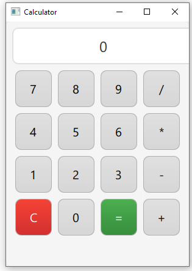

# Qt Quick Calculator

A simple, responsive calculator built using Qt Quick (QML). This application supports basic arithmetic operations and features a sleek, modern interface with button animations, error handling, and a clear display option.

## Features

- Basic arithmetic operations: Addition, Subtraction, Multiplication, and Division
- Clear (`C`) button to reset the display
- Equals (`=`) button to evaluate the expression
- Responsive button press animations
- Error handling for invalid expressions

## Screenshots



## Installation

### Prerequisites

Before using this application, make sure you have the following installed:

- **Qt**: Download from [Qt Downloads](https://www.qt.io/download).
- **Qt Creator** (Optional): For a more streamlined development experience.

### Steps to Run

1. Clone this repository to your local machine:

   ```bash
   git clone https://github.com/yourusername/qt-quick-calculator.git
   cd qt-quick-calculator
